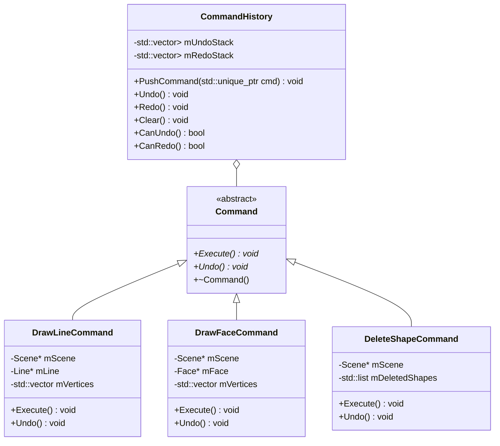
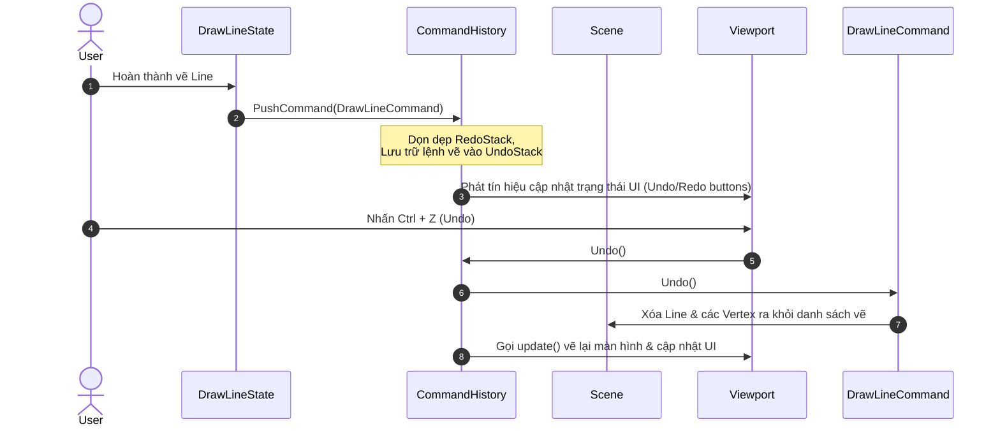

# Design Spec: Command Pattern & Undo/Redo Integration

Tài liệu này đặc tả thiết kế chi tiết cho việc tích hợp tính năng **Undo/Redo** sử dụng **Command Pattern** kết hợp với lệnh **Xóa thực thể (Delete Shape)** trong ứng dụng `simple-2d-cad`.

---

## 1. Phương án Thiết kế & Đánh giá (Architecture Options)

Chúng ta cân nhắc hai phương án để tích hợp Command Pattern vào ứng dụng Qt C++:

### Phương án 1: Tự triển khai Command Pattern thuần C++ (Khuyên dùng)
*   **Mô tả:** Tự định nghĩa các lớp `Command`, `CommandHistory` sử dụng các cấu trúc dữ liệu chuẩn của C++ (`std::vector`, `std::unique_ptr`).
*   **Ưu điểm:** 
    *   Thể hiện sâu sắc tư duy thiết kế hướng đối tượng (OOP) và khả năng quản lý bộ nhớ thủ công/con trỏ thông minh (`std::unique_ptr`, `std::shared_ptr`) trong C++ trên CV của bạn. Đây là kỹ năng cốt lõi mà các nhà tuyển dụng C++ CAD tìm kiếm.
    *   Không phụ thuộc chặt chẽ vào Qt, mã nguồn có thể dễ dàng chuyển đổi sang các framework khác (như MFC hoặc OpenGL thuần).
*   **Nhược điểm:** Phải tự quản lý bộ nhớ của các đối tượng hình học (`Shape`) khi chúng bị xóa và khôi phục để tránh rò rỉ bộ nhớ.

### Phương án 2: Sử dụng `QUndoStack` và `QUndoCommand` của Qt
*   **Mô tả:** Sử dụng framework Undo tích hợp sẵn của Qt.
*   **Ưu điểm:** Code ngắn hơn, Qt tự quản lý vòng đời và bộ nhớ của các lệnh.
*   **Nhược điểm:** Giảm bớt cơ hội chứng minh khả năng thiết kế cấu trúc dữ liệu và quản lý bộ nhớ C++ core trong CV của bạn.

> [!TIP]
> **Quyết định:** Chọn **Phương án 1 (Tự triển khai Command Pattern thuần C++ với std::unique_ptr)** để tạo điểm nhấn kỹ thuật tốt nhất cho CV ứng tuyển.

---

## 2. Kiến trúc Lớp (Class Architecture)

Sơ đồ lớp mô tả cấu trúc hệ thống lệnh mới:

### Chi tiết các lớp:
1.  **`Command`**: Lớp cơ sở trừu tượng.
2.  **`DrawLineCommand`**: Lưu trữ con trỏ tới `Line` mới vẽ và các `Vertex` tương ứng để thêm/xóa chúng khỏi `Scene`.
3.  **`DrawFaceCommand`**: Lưu trữ con trỏ tới `Face` mới vẽ và danh sách đỉnh `Vertex` tương ứng để thêm/xóa chúng khỏi `Scene`.
4.  **`DeleteShapeCommand`**: Lưu trữ danh sách các thực thể bị xóa. Khi `Execute()`, các thực thể này bị loại khỏi `Scene` (nhưng chưa giải phóng bộ nhớ). Khi `Undo()`, chúng được đẩy ngược lại `Scene`. Bộ nhớ của các thực thể này chỉ thực sự bị giải phóng trong hàm hủy (`~DeleteShapeCommand()`) nếu lệnh này không bị Undo.
5.  **`CommandHistory`**: Quản lý lịch sử lệnh bằng cơ chế ngăn xếp. Khi một lệnh mới được thêm vào, ngăn xếp Redo sẽ bị xóa sạch.

---

## 3. Luồng Hoạt động (Sequence Flows)

### Luồng Undo / Redo lệnh Vẽ (Draw Line)

---

## 4. Thiết kế Giao diện UI/UX (Qt Desktop)

Mặc dù là ứng dụng Desktop, ta vẫn thiết kế giao diện tinh tế, trực quan:
*   **Thanh công cụ (Toolbar):** 
    *   Thêm 2 nút bấm kế bên nút Save: **Undo** (Icon mũi tên quay trái) và **Redo** (Icon mũi tên quay phải).
    *   Tooltip hiển thị rõ ràng: `Undo (Ctrl+Z)` và `Redo (Ctrl+Y)`.
    *   Trạng thái nút bấm thay đổi linh hoạt:
        *   Nếu `CommandHistory::CanUndo()` trả về `false` $\rightarrow$ Nút Undo bị vô hiệu hóa (disabled - mờ đi).
        *   Nếu `CommandHistory::CanRedo()` trả về `false` $\rightarrow$ Nút Redo bị vô hiệu hóa (disabled - mờ đi).
*   **Phím tắt:**
    *   Sử dụng phím tắt chuẩn của Windows: `QKeySequence::Undo` (`Ctrl+Z`) và `QKeySequence::Redo` (`Ctrl+Y`).
    *   Phím `Delete` được liên kết với hành động xóa thực thể đang chọn.

---

## 5. Phương án Quản lý Bộ nhớ C++ An toàn (Memory Safety)

Quản lý bộ nhớ là phần quan trọng nhất để tránh rò rỉ bộ nhớ (Memory Leaks) khi xóa và khôi phục thực thể:
*   Khi vẽ hình học mới, `Scene` nhận quyền sở hữu con trỏ (`Shape*`).
*   Khi thực hiện lệnh **Delete**, con trỏ `Shape*` bị loại khỏi danh sách của `Scene` nhưng **không được `delete` ngay**, mà được chuyển quyền sở hữu sang `DeleteShapeCommand`.
*   Nếu `DeleteShapeCommand` bị hủy (ví dụ: bị dọn dẹp khỏi Stack khi UndoStack quá giới hạn, hoặc ứng dụng tắt), hàm hủy `~DeleteShapeCommand()` sẽ thực hiện `delete` toàn bộ các con trỏ `Shape*` mà nó đang sở hữu.
*   Nếu thực hiện **Undo** lệnh `DeleteShapeCommand`, quyền sở hữu con trỏ `Shape*` lại được chuyển ngược từ Command về cho `Scene`.

---

## 6. Kế hoạch Kiểm thử & Xác minh (Verification Plan)

### Kiểm thử Thủ công (Manual Verification):
1.  **Vẽ Line / Face $\rightarrow$ Undo:** Các hình vẽ và các chấm đỉnh tương ứng biến mất khỏi màn hình.
2.  **Redo sau khi Undo:** Hình vẽ xuất hiện lại chính xác tại tọa độ cũ.
3.  **Vẽ $\rightarrow$ Undo $\rightarrow$ Vẽ tiếp hình mới:** Nút **Redo** phải bị vô hiệu hóa (Redo stack bị xóa sạch khi có hành động mới).
4.  **Chọn hình $\rightarrow$ Nhấn Delete $\rightarrow$ Undo:** Hình vẽ biến mất khi nhấn Delete và xuất hiện lại khi Undo.
5.  **Kiểm tra Rò rỉ Bộ nhớ (Memory Leak Check):** Chạy ứng dụng dưới chế độ Debug của Visual Studio để theo dõi xem có đối tượng nào không được giải phóng khi đóng chương trình hoặc khi thực hiện xóa nhiều hình vẽ.
